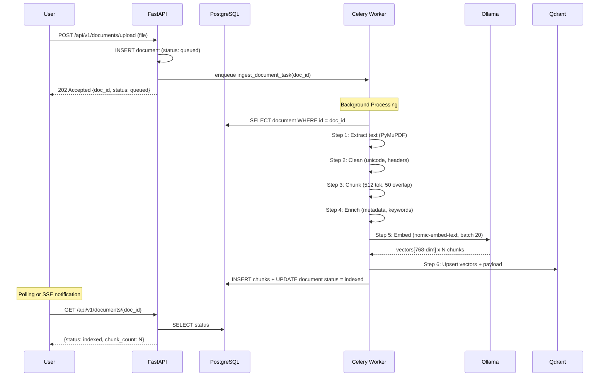
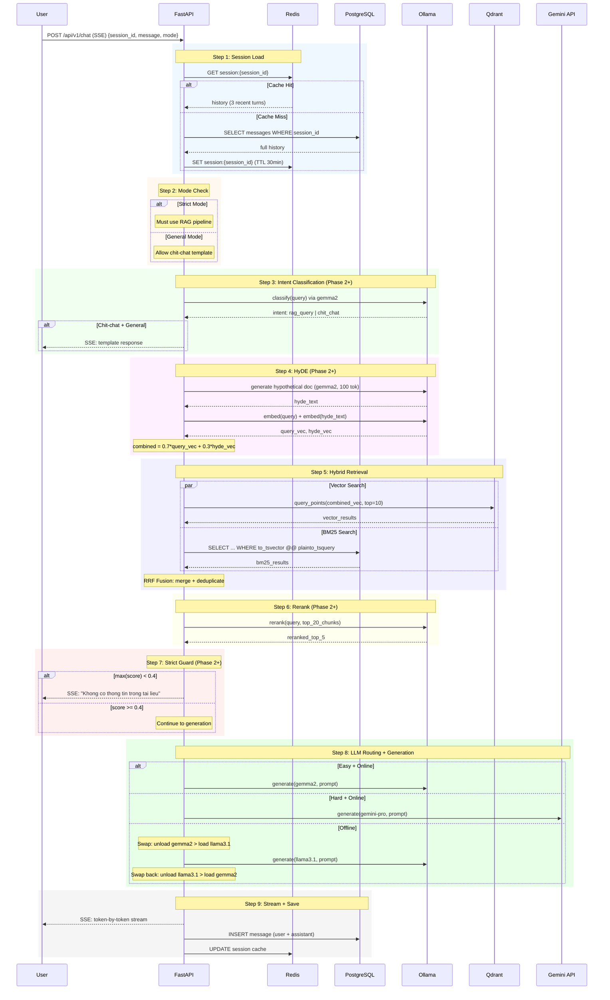
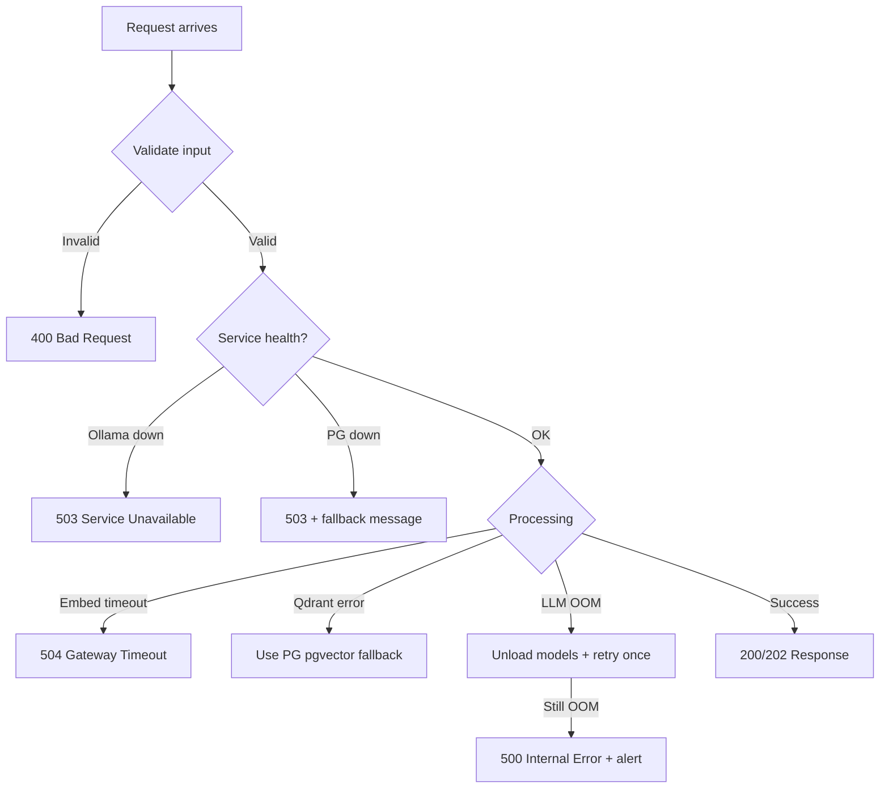

# Data Flow - RAG Chatbot 10GB
## Document Pipeline + Chat Pipeline Chi Tiet

**Author:** Alpha (System Architect)
**Version:** 1.1
**Updated:** 2026-03-20 — Reconciled with deployed system (model paths, Qdrant API, guard threshold)

---

## 1. Document Ingestion Pipeline (Async)

### 1.1 Overview Flow



### 1.2 Pipeline Steps Detail

#### Step 1: Extract
```
Input:  Raw file (PDF, DOCX, MD)
Output: Raw text string
Tool:   PyMuPDF (fitz) cho PDF, python-docx cho DOCX, plain read cho MD
Notes:
  - PDF: extract per page, giu page_number metadata
  - DOCX: extract paragraphs + tables
  - MD: read as-is
  - Max file size: 50MB
  - Unsupported format -> return error 415
```

#### Step 2: Clean
```
Input:  Raw text
Output: Cleaned text
Operations:
  1. Unicode NFKC normalization
  2. Remove repeated headers/footers (detect by frequency across pages)
  3. Fix hyphenated line breaks ("exam-\nple" -> "example")
  4. Collapse multiple whitespace -> single space
  5. Remove control characters (except \n, \t)
  6. Detect language (vi/en) -> store in metadata
```

#### Step 3: Chunk
```
Input:  Cleaned text
Output: List[ChunkData]
Config:
  - Method: RecursiveCharacterTextSplitter
  - chunk_size: 512 tokens
  - chunk_overlap: 50 tokens
  - separators: ["\n\n", "\n", ". ", " ", ""]
  - length_function: tiktoken (cl100k_base)
Output per chunk:
  {
    content: str,
    chunk_index: int,
    page_number: int,       # from extract step
    char_count: int,
    token_count: int
  }
```

#### Step 4: Enrich
```
Input:  List[ChunkData]
Output: List[EnrichedChunk]
Operations:
  1. Extract section_header: nearest heading before chunk
  2. Keywords: TF-IDF top 3 per chunk
  3. Language: vi/en detection per chunk
  4. doc_id: reference to parent document
Metadata schema (JSONB):
  {
    "section": "Chapter 2: Methodology",
    "keywords": ["regression", "analysis", "data"],
    "language": "en",
    "page": 5,
    "chunk_idx": 12,
    "char_count": 1847
  }
```

#### Step 5: Embed
```
Input:  List[EnrichedChunk].content
Output: List[Vector(768)]
Model:  nomic-embed-text (Ollama, 0.3GB)
Config:
  - batch_size: 20 chunks per request
  - dimension: 768
  - normalize: true (L2 norm)
  - prefix: "search_document: " (nomic convention)
API:    POST http://ollama:11434/api/embeddings
```

#### Step 6: Index
```
Input:  List[EnrichedChunk] + List[Vector]
Output: Qdrant points + PG chunk records
Operations:
  1. Qdrant: upsert points with payload
     - id: chunk UUID
     - vector: 768-dim float32
     - payload: {doc_id, page, section, keywords, language}
  2. PostgreSQL: INSERT INTO chunks
     - content, embedding (pgvector backup), metadata (JSONB)
     - document_id FK
  3. Update document status -> indexed
  4. Update document chunk_count
```

---

## 2. Chat Query Pipeline (Sync SSE)

### 2.1 Overview Flow



### 2.2 Pipeline Steps Detail

#### Step 1: Session Load
```
Priority: Redis (Hot) -> PostgreSQL (Warm)
Redis key:  session:{session_id}
Redis TTL:  1800 seconds (30 min)
Redis data: JSON {messages: [{role, content, timestamp}], mode: str}
If new session: CREATE in PG + SET in Redis
Load last 3 turns for context window management
```

#### Step 2: Mode Check
```
Mode:   request.mode || session.default_mode
Values: "strict" | "general"
Strict: ALL queries must go through RAG pipeline
General: Chit-chat queries get template response, RAG queries normal pipeline
Default: "strict" (safe default)
```

#### Step 3: Intent Classification (Phase 2+)
```
Model:  gemma-2-2b-it (Q8_0 GGUF)
Prompt: "Classify: is this a document question or chit-chat? Reply only: RAG or CHAT"
Input:  user query
Output: "RAG" | "CHAT"
Rules:
  - Strict mode: skip classification, always RAG
  - General mode + CHAT: respond with guided template (not freeform)
  - General mode + RAG: continue pipeline
Phase 1: Skip, treat all as RAG
```

#### Step 4: HyDE - Hypothetical Document Embedding (Phase 2+)
```
Model:  gemma-2-2b-it (Q8_0 GGUF)
Prompt: "Given this question, write a short paragraph that would answer it: {query}"
Config: max_tokens=100, temperature=0.3
Process:
  1. Generate hypothetical answer text
  2. Embed query: query_vec = embed(query)
  3. Embed hyde: hyde_vec = embed(hyde_text)
  4. Combine: combined_vec = 0.7 * query_vec + 0.3 * hyde_vec
  5. Normalize combined_vec
Purpose: Captures semantic intent even when query lacks exact keywords
Phase 1: Skip, use query_vec directly
```

#### Step 5: Hybrid Retrieval
```
Phase 1: Vector search only (Qdrant)
Phase 2+: Vector + BM25 with RRF fusion

Vector Search (Qdrant):
  - Query: combined_vec (or query_vec in Phase 1)
  - top_k: 10
  - Score filter: none (let reranker handle)

BM25 Search (PostgreSQL):
  - Query: to_tsvector('simple', content) @@ plainto_tsquery('simple', query)
  - top_k: 5
  - Use GIN index

RRF (Reciprocal Rank Fusion):
  score(d) = sum( 1 / (k + rank_i(d)) ) for each retriever i
  k = 60 (constant)
  Merge: deduplicate by chunk_id, take top 20
```

#### Step 6: Rerank (Phase 2+)
```
Model:  bge-reranker-v2 (sentence-transformers, 0.4GB)
Input:  [(query, chunk.content)] x 20 pairs
Output: [(chunk, relevance_score)] sorted desc
Take:   top 5
Phase 1: Skip, use vector scores directly, take top 5
```

#### Step 7: Strict Guard (Phase 2+)
```
Threshold: 0.4 (configurable via STRICT_GUARD_THRESHOLD env)
Logic:
  if mode == "strict":
    if max(scores) < threshold:
      return "Khong co thong tin lien quan trong tai lieu da upload."
    else:
      continue with top chunks where score >= threshold
  else (general):
    continue regardless (but still use scores for ranking)
Note: Without cross-encoder reranker, pipeline falls back to vector_score
  (cosine similarity 0-1) instead of rrf_score. Threshold 0.4 is calibrated
  for cosine similarity; was 0.7 when using cross-encoder reranker scores.
Phase 1: Skip, always continue
```

#### Step 8: LLM Routing + Generation
```
Prompt Assembly:
  system_prompt = """Ban la tro ly AI. Tra loi dua tren context duoc cung cap.
  Neu context khong du, noi "Toi khong co du thong tin."
  Luon trich dan nguon (ten file, trang)."""

  context = "\n---\n".join([
    f"[{chunk.doc_name}, trang {chunk.page}]\n{chunk.content}"
    for chunk in top_chunks
  ])

  messages = [
    {"role": "system", "content": system_prompt},
    {"role": "system", "content": f"Context:\n{context}"},
    *history[-3:],  # last 3 turns
    {"role": "user", "content": query}
  ]

Routing:
  Easy + Online  -> gemma-2-2b-it via Ollama (hf.co/MaziyarPanahi/gemma-2-2b-it-GGUF:Q8_0)
  Hard + Online  -> Gemini API (cloud, 0 RAM)
  Any + Offline  -> llama3.1:8b (Ollama, swap required)

Complexity Detection:
  Hard = len(query) > 200 OR requires multi-document reasoning OR explicit user flag
  Easy = everything else
```

#### Step 9: Stream + Save
```
SSE Format:
  event: token
  data: {"content": "tok", "done": false}

  event: token
  data: {"content": "", "done": true, "sources": [...], "model": "gemma-2-2b-it"}

Save:
  1. INSERT user message to PG
  2. INSERT assistant message (full text) to PG
  3. UPDATE Redis session cache with new turns
  4. If session has > 20 messages: trigger warm archival background task
```

---

## 3. Data Flow Summary Table

| Flow | Trigger | Input | Output | Latency Target |
|------|---------|-------|--------|----------------|
| Upload | POST /upload | File (PDF/DOCX/MD) | doc_id + status | < 30s (Phase 1 sync) |
| Chat (Easy) | POST /chat | message + session_id | SSE stream | First token < 2s |
| Chat (Hard, Cloud) | POST /chat | message + hard flag | SSE stream | First token < 3s |
| Chat (Offline, Swap) | POST /chat | message + offline | SSE stream | First token < 15s (swap time) |
| Session Load | Internal | session_id | history | < 50ms (Redis hit) |
| Archival | Cron (hourly) | - | Warm tier compress | Background |

---

## 4. Error Handling Flow



### Error Codes

| Code | Scenario | Action |
|------|----------|--------|
| 400 | Invalid input (wrong format, too large) | Return validation errors |
| 404 | Document/session not found | Return not found message |
| 413 | File > 50MB | Reject with size limit info |
| 415 | Unsupported file type | Return supported types list |
| 422 | Pydantic validation error | Return field errors |
| 429 | Rate limit (> 10 req/min) | Return retry-after header |
| 500 | Internal error | Log + alert + generic message |
| 503 | Service unavailable (Ollama/PG/Qdrant down) | Health check details |
| 504 | Embedding/generation timeout | Retry suggestion |
