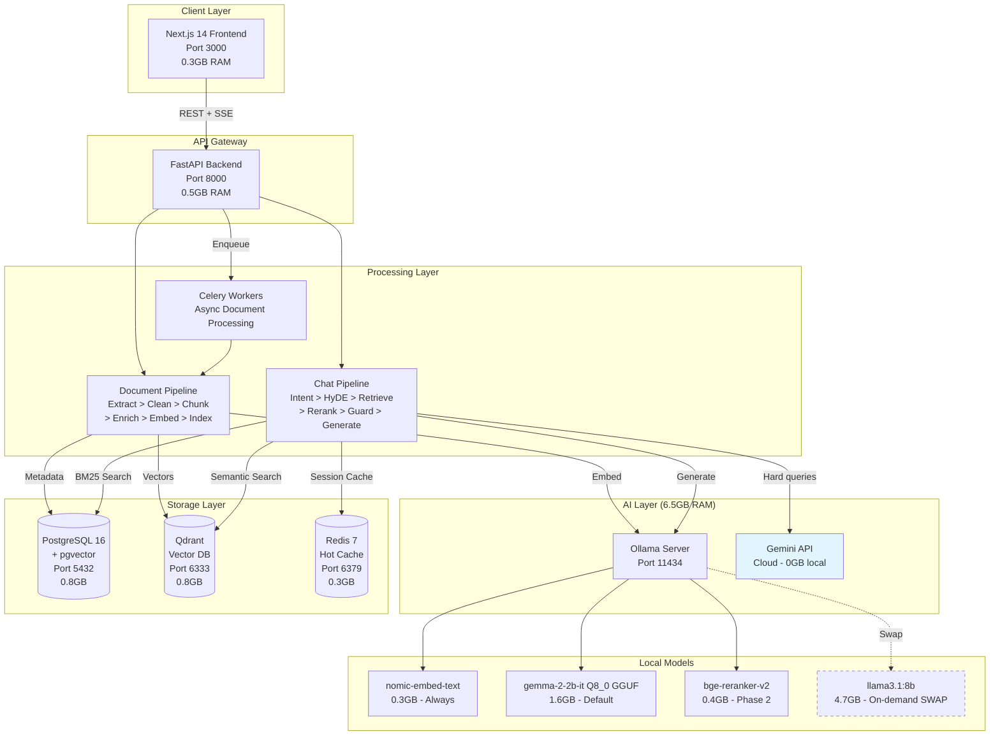
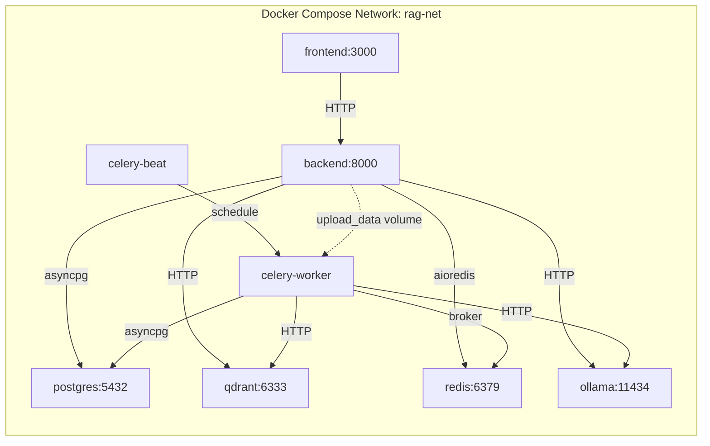
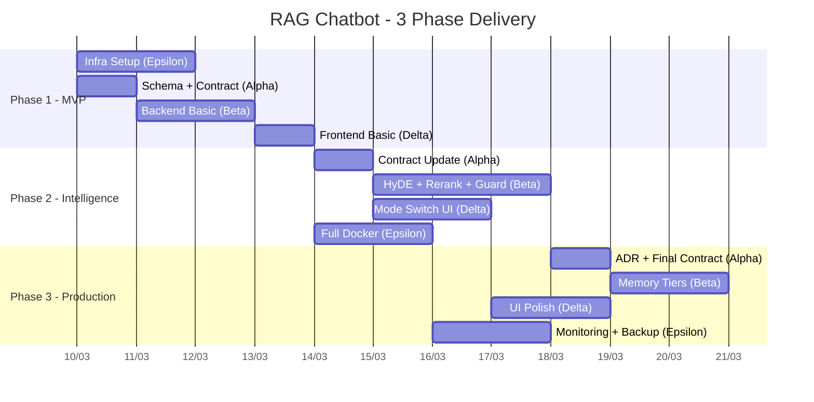

# System Overview - RAG Chatbot 10GB
## High-Level Architecture Document

**Author:** Alpha (System Architect)
**Version:** 1.1
**Updated:** 2026-03-20 — Reconciled with deployed system (model paths, memory limits, guard threshold)
**Constraint:** 10GB RAM hard limit

---

## 1. System Context

RAG Chatbot la mot he thong hoi dap thong minh dua tren tai lieu, hoat dong trong gioi han 10GB RAM. He thong ho tro 2 che do: **Strict** (chi tra loi dua tren tai lieu) va **General** (cho phep hoi dap huong dan).

### Actors
- **End User**: Upload tai lieu, dat cau hoi, nhan phan hoi
- **Admin**: Quan ly tai lieu, theo doi RAM, reindex

---

## 2. High-Level Architecture

---

## 3. Service Topology

### Port Mapping

| Service      | Internal Port | External Port | Protocol |
|-------------|---------------|---------------|----------|
| Frontend    | 3000          | 3000          | HTTP     |
| Backend     | 8000          | 8000          | HTTP     |
| PostgreSQL  | 5432          | 5432          | TCP      |
| Qdrant      | 6333          | 6333          | HTTP     |
| Qdrant gRPC | 6334          | 6334          | gRPC     |
| Redis       | 6379          | 6379          | TCP      |
| Ollama      | 11434         | 11434         | HTTP     |

---

## 4. Layer Responsibilities

### 4.1 Client Layer (Next.js 14)
- Server-Side Rendering cho SEO va initial load
- SSE (Server-Sent Events) client cho streaming responses
- Mode Toggle UI (Strict / General)
- Document upload voi drag-and-drop
- Session management (sidebar)

### 4.2 API Gateway (FastAPI)
- REST API voi OpenAPI 3.1 auto-docs
- SSE streaming endpoint cho chat
- Request validation (Pydantic v2)
- CORS middleware
- Dependency injection (DB sessions, Redis, Qdrant clients)

### 4.3 Processing Layer
- **Document Pipeline**: Extract > Clean > Chunk > Enrich > Embed > Index
- **Chat Pipeline**: Intent Classify > HyDE > Hybrid Retrieve > Rerank > Guard > Generate > Stream
- **Workers**: Celery cho async document processing, session archival

### 4.4 AI Layer
- **Ollama**: Local model serving voi memory-aware scheduling
- **Gemini API**: Cloud fallback cho hard queries (khong ton RAM local)
- **Model Swap**: Chi 1 large LLM (gemma-2-2b-it HOAC llama3.1) tai 1 thoi diem

### 4.5 Storage Layer
- **PostgreSQL 16 + pgvector**: Metadata, chat history, BM25 full-text search, backup vector storage
- **Qdrant**: Primary vector search (HNSW index, 768-dim cosine)
- **Redis 7**: Hot session cache (3 recent turns, TTL 30min), Celery broker

---

## 5. Phase Deployment View

---

## 6. Key Design Decisions (Summary)

| Decision | Choice | Reason |
|----------|--------|--------|
| Vector DB | Qdrant (separate) | Chuyen biet cho vector search, HNSW tuning, khong share resources voi PG |
| Backup vectors | pgvector (PostgreSQL) | Fallback khi Qdrant down, dung cho BM25 hybrid |
| LLM serving | Ollama | Self-hosted, model swap API, memory control |
| Cloud fallback | Gemini API | Free tier 15 RPM, khong ton RAM local |
| Task queue | Celery + Redis | Mature, async document processing, cron scheduling |
| Frontend | Next.js 14 App Router | SSR, streaming support, TypeScript |
| Streaming | SSE (not WebSocket) | Simpler, unidirectional (server > client), HTTP/2 compatible |

---

## 7. Constraints & Boundaries

1. **RAM Hard Limit**: Tong 10GB - moi component co memory limit trong docker-compose
2. **Model Exclusivity**: KHONG BAO GIO load dong thoi gemma-2-2b-it (1.6GB) va llama3.1 (4.7GB)
3. **Concurrency**: Max 5-10 concurrent chat sessions
4. **File Size**: Max upload 50MB per file (PDF, DOCX, MD)
5. **Chunk Size**: 512 tokens, 50 token overlap (RecursiveCharacterTextSplitter)
6. **Embedding Dim**: 768 (nomic-embed-text)
7. **Guard Threshold**: relevance >= 0.4 cho Strict mode (vector cosine similarity; lowered from 0.7 since reranker unavailable, pipeline uses `vector_score` fallback)
